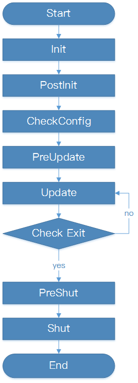

# 快速开发一个新模块

## 一个简单的模块的搭建

```cpp
#pragma once

#include "SDK/Interface/AFIPlugin.h"
#include "SDK/Interface/AFIPluginManager.h"
#include "SDK/Interface/AFITimerModule.h"
#include "SDK/Interface/AFILogModule.h"
#include "SDK/Interface/AFIScheduleModule.h"

namespace ark
{

    class Example1Module : public AFIModule
    {
    public:
        explicit Example1Module() = default;

        bool Init() override;
        bool PostInit() override;
        bool Update() override;
        bool PreShut() override;
        bool Shut() override;

    protected:
        AFITimerModule* m_pTimerModule;
        AFILogModule* m_pLogModule;

        int my_test_;
    };

}
```

说明:

- 所有的模块都继承自AFIModule
- 模块类中包含几个常规的状态机执行函数(稍后详细讲解)
- 模块类的成员变量除过自己逻辑功能的变量外, 主要成员变量为其他模块指针, 用来调用其他模块的功能(请自行搜索**面向接口编程IOP**)

## 模块执行状态机

前文提到, 我们所有的模块都继承自`AFIModule`, AFIModule中主要包含了如下几个插件在不同状态下执行的虚函数, 如下

```cpp
namespace ark
{
    class AFIPluginManager;

    class AFIModule
    {
    public:
        AFIModule() = default;
        virtual ~AFIModule() = default;

        //模块初始化函数, 主要用来查找模块中用到的其他模块接口指针
        virtual bool Init() { return true; }

        //初始化后执行的函数
        virtual bool PostInit() { return true; }

        //检查配置, 用来做模块启动后相关配置资源的合法性检查
        virtual bool CheckConfig() { return true; }

        //update前处理的函数, 例如update前想注册类回调, DataNode回调等等
        virtual bool PreUpdate() { return true; }

        //帧循环函数, 是个死循环, 主要用来处理一直需要处理的事件, 例如timer, network等
        virtual bool Update() { return true; }

        //关闭前需要做的事情, 例如销毁资源等
        virtual bool PreShut() { return true; }

        //关闭的时候需要做的事情, 例如关闭log文件等等
        virtual bool Shut() { return true; }
    }
}
```

模块执行流程图:

